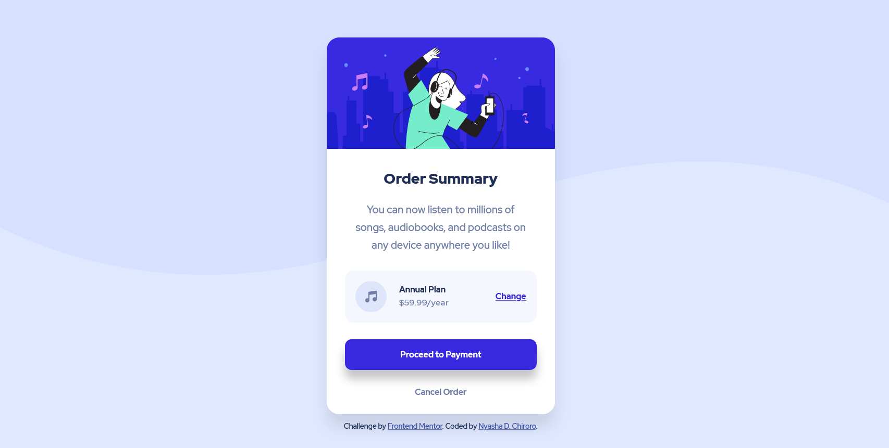

# Frontend Mentor - Order summary card solution

This is a solution to the [Order summary card challenge on Frontend Mentor](https://www.frontendmentor.io/challenges/order-summary-component-QlPmajDUj). Frontend Mentor challenges help you improve your coding skills by building realistic projects.

## Table of contents

- [Frontend Mentor - Order summary card solution](#frontend-mentor---order-summary-card-solution)
  - [Table of contents](#table-of-contents)
  - [Overview](#overview)
    - [The challenge](#the-challenge)
    - [Screenshots](#screenshots)
    - [Links](#links)
  - [My process](#my-process)
    - [Built with](#built-with)
    - [What I learned](#what-i-learned)
    - [Continued development](#continued-development)
    - [Useful resources](#useful-resources)
  - [Author](#author)

## Overview

### The challenge

-   the challenge wass to build out the order summary card component and get it looking as close to the design as possible.
-   Users should be able to see hover states for interactive elements

### Screenshots




### Links

-   Solution URL: [Add solution URL here](https://your-solution-url.com)
-   Live Site URL: [https://serene-kirch-55d40a.netlify.app/](https://serene-kirch-55d40a.netlify.app/)

## My process

### Built with

-   Semantic HTML5 markup
-   CSS custom properties
-   BEM Methodology
-   Flexbox
-   Mobile-first workflow
-   [Vite](https://vitejs.dev/) - Frontend build tool

### What I learned

1. Whenever you start a new project try, set up your enviroment and all the things you are going to use first. What do I mean by this? Well you need to think about some essential tools you will need to make the process go a bit smooth. For example any build tools you will need. I have found that some tools are a bit hard to integrate into the project once you have moved signficantly through the project. I had some issues with parcel and vite which I think was a result of not setting these up initially. But maybe it was just an edge case.
2. If you are working with a design system or you have a predifined set of values for things like colors, fonts, and so on, move those into into CSS variables or SCSS variables (if you are working with SCSS) as soon as you start the project. This will help you focus more on the HTML and CSS side of your project rather than constantly switching between your design file and your CSS to check for those values. That context switch may hurt your productivity. Set up those values ahead of time. The only reason to go back your design fine should be to compare your website and that design.
3. Sometimes you won't have a design file. You may have just an image of the design, which is the case when you are doing Frontend Mentor challenges on a free account. You can still code a website using those images. That is fine. You could also take that as an opportunity to practice some design. Try to recreate that design in an app like [Adobe XD](https://www.adobe.com/products/xd.html) or [Figma](https://www.figma.com/). The process of recreating that design will actually improve your design skills over time. You could also jump into sites like [Behance](https://www.behance.net/) and [Dribble](https://dribbble.com/) and do the same thing. Try to the amazing design works you will find there. If you can code it up. Hopefully overtime this will help you to come up with your own process for code and design.
4. If you are going to use BEM CSS then you are probably better off using a CSS preprocessor like [SASS/SCSS](https://sass-lang.com/). Repeating the same selector or at least parts of it can get annoying. What do I mean? Use something like the code below.
    ```css
    .block {
        &--modifier {
            property: value;
        }
        &__element1 {
            property: value;
        }
        &__element2 {
            &--modifier {
                property: value;
            }
        }
    }
    ```
    Instead of something like this:
    ```css
    .block {
        property: value;
    }
    .block--modifier {
        property: value;
    }
    .block__element1 {
        property: value;
    }
    .block__element2 {
        property: value;
    }
    .block__element2--modifier {
        property: value;
    }
    ```
    This may just be a personal preference but I think it will save you a lot of time.

### Continued development

I hope to rebuild this component using [Tailwind CSS](https://tailwindcss.com/). I really like the framework and hope to add it to my skillset. In fact I have this idea to do every Frontend Mentor challenge using CSS or SCSS first then use Tailwind CSS. My goal is to implement a challenge using 2 technologies, at least. If the challenge has a need for JavaScript I will first try to implement it using vanilla JavaScript then use a framework like VueJs.

### Useful resources

-   [Next generation frontend tooling with ViteJS](https://www.youtube.com/watch?v=UJypSr8IhKY&t=758s) - This helped me understand the idea behind [Vite](https://vitejs.dev/).
-   [You Probably Need BEM CSS in Your Life](https://youtu.be/er1JEDuPbZQ) - This helped me understand BEM CSS.

## Author

-   Frontend Mentor - [@chiroro-jr](https://www.frontendmentor.io/profile/chiroro-jr)
-   Twitter - [@chiroro_jr](https://www.twitter.com/chiroro_jr)
